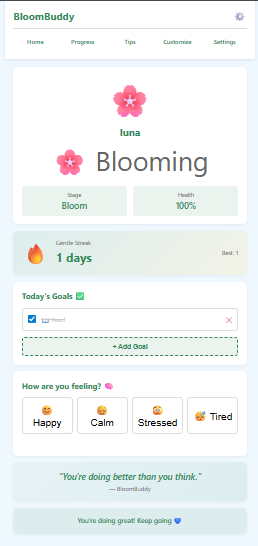
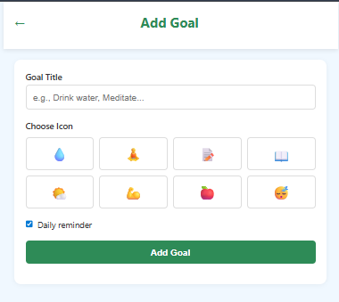
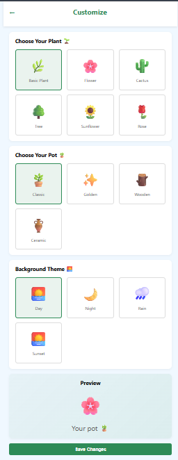
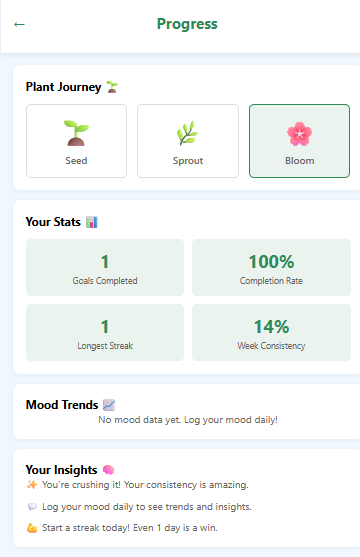
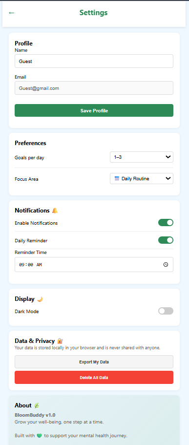

# 🌿 BloomBuddy – Gamified Mental Wellness Web App

## 📌 Overview

BloomBuddy is a web-based mental wellness and habit tracking app that uses a **plant growth system** to motivate users.

As users complete daily goals and maintain streaks, their virtual plant grows from a seed 🌱 to a blooming flower 🌸—representing personal progress and consistency.

---

## ✨ Core Idea

BloomBuddy turns self-improvement into a visual and engaging experience:

* 🌱 **Seed** → Getting started
* 🌿 **Sprout** → Building consistency
* 🌸 **Bloom** → Thriving habits

---

## 🌐 Live Demo
https://bloom-buddy-iota.vercel.app/

---

## 🚀 Features

### 🏠 Dashboard

* Personalized plant companion 🌿
* Streak tracking 🔥
* Daily goals overview

### 🎯 Goals System

* Add, complete, and delete goals
* Track daily progress
* Goal completion updates streak

### 🔥 Streak System

* Tracks daily consistency
* Maintains current & longest streak
* Resets intelligently based on activity

### 😊 Mood Tracking

* Log daily mood (Happy, Calm, Stressed, Tired)
* Stores mood history

### 📊 Progress Page

* Visual plant growth stages
* User statistics:

  * Goals completed
  * Completion rate
  * Longest streak
  * Weekly consistency

### 🧠 Mental Health Tips

* Stress management
* Better sleep guidance
* Mindfulness & meditation
* Healthy daily habits

### 🎨 Customization

* Choose plant type 🌱🌸🌵
* Select pot style 🪴
* Change background theme 🌞🌙🌧️

### ⚙️ Settings

* Profile management
* Preferences (goals/day, focus area)
* Notifications & reminders
* Dark mode support
* Local data storage & export

---

## 🛠 Tech Stack

* HTML
* CSS
* JavaScript
* localStorage (for data persistence)

---

## 🧱 Architecture

The app uses a centralized **DataManager module** to handle:

* User data
* Goals & streak logic
* Mood tracking
* Preferences

All data is stored locally in the browser using `localStorage`.

---

## 📸 Screenshots

## 📸 App Preview

### 🏠 Dashboard

### 🎯 Goals

### 🎨 Customization (Themes & Plant Selection)

### 📊 Progress

### ⚙️ Settings

---

## ▶️ How to Run

1. Clone the repository
2. Open `index.html` in your browser

---

## ⚠️ Note

This project was built with the help of AI tools.
I focused on designing the concept, user experience, and application logic, and I understand the core implementation.

---

## 🔮 Future Improvements

* 🤖 AI-based mood & habit insights
* ☁️ Backend integration (Firebase / Node.js)
* 👤 User authentication
* 📈 Advanced analytics & graphs
* 📱 Mobile app version

---

## 💡 Inspiration

BloomBuddy is inspired by the idea that **small daily actions lead to meaningful growth**, just like taking care of a plant.

---

## 📌 Project Status

🚧 Prototype – actively being improved and expanded
